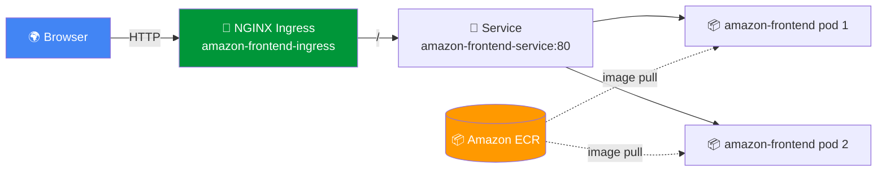

<div align="center">

# 🛒 Amazon Clone — Single Frontend on Kubernetes + Ingress

### A static Amazon-style shopping site containerized with **Docker**, pushed to **Amazon ECR**, and served on **Kubernetes** via a **Deployment**, **LoadBalancer Service**, and **NGINX Ingress**

<p>


</p>

</div>

---

## 🎯 Overview

A single-page Amazon clone (`index.html`, `cart.html`, `payment.html` + `script.js` / `style.css`) baked into an NGINX image and exposed on Kubernetes.

| 📄 Manifest | 📝 Role |
|:--|:--|
| `Dockerfile` | Packages the static site into NGINX |
| `k8s/deployment.yml` | `amazon-frontend` Deployment (2 replicas, port 80) |
| `k8s/service.yml` | Service exposing the pods |
| `k8s/ingress.yml` | NGINX Ingress (`amazon-frontend-service:80`) |

---

## 🏗 Architecture



---

## 🚀 Setup — Step by Step

### 1️⃣ Build & push the image to ECR

```bash
aws ecr create-repository --repository-name amazon-frontend
docker build -t amazon-frontend .
docker tag amazon-frontend:latest <acct>.dkr.ecr.<region>.amazonaws.com/amazon-frontend:latest
aws ecr get-login-password --region <region> | docker login --username AWS --password-stdin <acct>.dkr.ecr.<region>.amazonaws.com
docker push <acct>.dkr.ecr.<region>.amazonaws.com/amazon-frontend:latest
```

### 2️⃣ Set the image in the manifest

Edit `k8s/deployment.yml` and replace `<your-ecr-repo>/amazon-frontend:latest` with the pushed image URI.

### 3️⃣ Install the NGINX Ingress Controller (once)

```bash
kubectl apply -f https://raw.githubusercontent.com/kubernetes/ingress-nginx/main/deploy/static/provider/cloud/deploy.yaml
```

### 4️⃣ Deploy

```bash
kubectl apply -f k8s/deployment.yml
kubectl apply -f k8s/service.yml
kubectl apply -f k8s/ingress.yml

kubectl get pods
kubectl get svc
kubectl get ingress
```

> Set `host:` in `k8s/ingress.yml` to your domain (or add it to `/etc/hosts` pointing at the ingress LB) to reach the site.

---

<div align="center">

### ⭐ Docker · ECR · Kubernetes · NGINX Ingress

</div>
